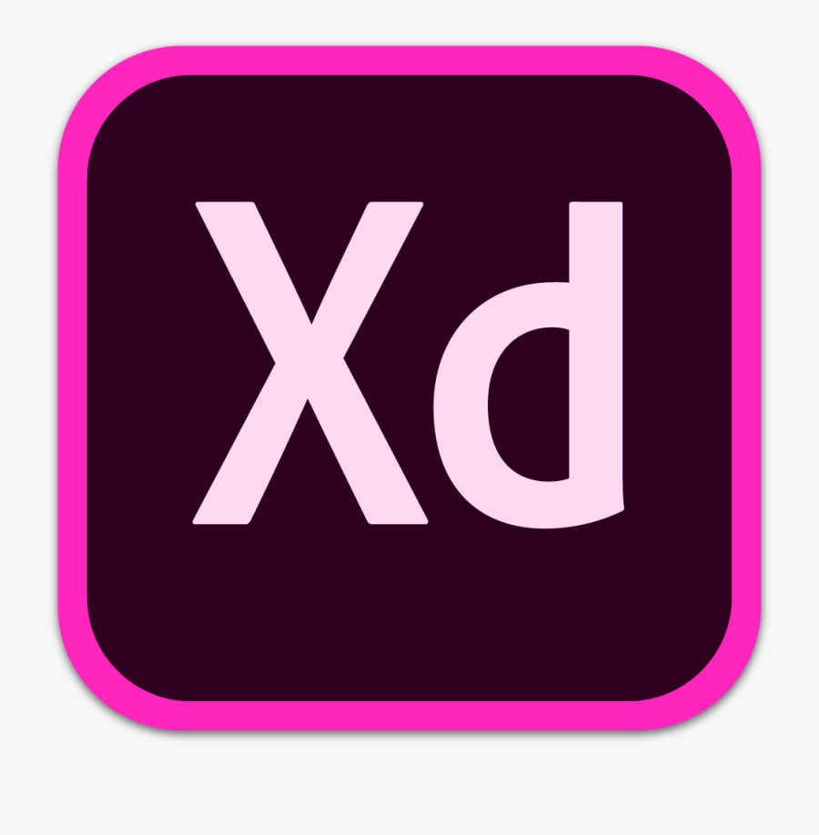

<h1 align="start">Hi 👋, I'm Tokir Ahmad Shakib</h1>

I’m a Front End Web developer who is passionate about making error-free websites with 100% client satisfaction. I have a passion for learning and sharing my knowledge with others as publicly as possible. I love to solve real-world problems. I am strategic, goal-oriented, and always work with an end goal in mind. Over the past years, I created 100s of websites for my clients

## 🚀 About Me

👑 I am Web Developer   
🖊️ Love to write code   
🎤 Like to share my knowledge  
  😄 Pronouns: He, Fat & Happy 😄

 

## ⚡ Technologies

 

## 👨‍💻 Tools : 
 

  
  
 
 
 
 

## ☕ Connect with me!
 

